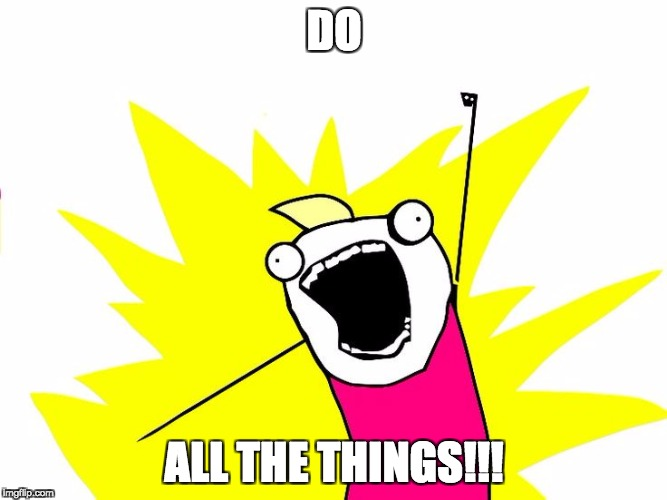

# Execution Backends

## Overview
After we've thought of all the possibilities, we then have to decide what we want to do or say.  That's where Will's execution backends come in.

They take the context created by `analysis`, and the options created by `generation`, and make a decision on what to do.

Will has the following execution backends built-in, and it's easy to make your own or contribute one to the project:

- All (`will.backends.execution.all`)
- Best Score (`will.backends.execution.best_score`)


## Choosing your backends


Here's a bit more about the built-ins, and when they'd be a good fit:

### All (`will.backends.execution.all`)



This is Will's crazy, do-everything mode.  He'll take every idea he got in the generation cycle and do *all* of them.  Why?  Because he's crazy like that.

Or, more likely, because you've built a custom generation backend that limits him down to a set of options you always want done.


### Best Score (`will.backends.execution.best_score`)

This is the right fit for most people, and it's the most similar to how our brains work.  Will looks at the options he has, and picks the single one he thinks is the best.

## Setting your backends

To set your execution backends, just update the following in `config.py`

```python
# The "decision making" backends that look among the generated choices,
# and decide which to follow. Backends are executed in order, and any
# backend can stop further evaluation.
EXECUTION_BACKENDS = [
    "will.backends.execution.best_score",
    # "will.backends.execution.all",
]
```


## Contributing a new backend

Writing a new execution backend is reasonably straightforward - simply subclass `ExecutionBackend`, and implement `handle_execution`, making sure to call `self.execute(option)` for the option(s) you choose.:

```python
from will.backends.execution.base import ExecutionBackend


class MyRandomExecutionBackend(ExecutionBackend):

    def handle_execution(self, message):
        random_option = random.choice(message.generation_options)
        self.execute(random_option)

```

From there, just test it out, and when you're ready, submit a [pull request!](https://github.com/skoczen/will/pulls)

That's it for Will's decision making.  If you'd like a little more esoteric deep-dive, let's look at how his [short-term memory (pubsub)](/platform/pubsub).