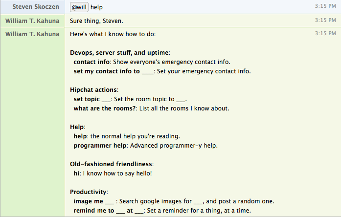
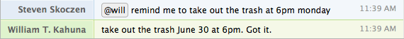

# Plugin Builtins

Will's `WillPlugin` class packs in lots of useful functionality to make writing powerful plugins simple.  Let's go through it.


## Storage

Will can remember almost any python object (using [dill](https://pypi.python.org/pypi/dill)), even across reboots.

It's as simple as:

```python
self.save("my_key", "my_value")
self.load("my_key", "default value")
self.append("my_key", "value")
self.pop("my_key", "value")
```

You can also save a value temporarily by setting the number of seconds before it expires:

```python
self.save("my_key", "my_value", expire=10)
```


## Template rendering

Will includes [Jinja](http://jinja.pocoo.org/) for powerful awesome template rendering.  To use it, just call `self.rendered_template()`


```python
self.rendered_template(template_name, context={}, custom_filters=[])
```

- **`template_name`**: path to the template, relative to the `TEMPLATE_DIRS` specified in `config.py`.
- **`context`**: a dictionary to render the template with.
- **`custom_filters`**: [custom filters](http://jinja.pocoo.org/docs/2.9/api/#custom-filters)  support for rendering templates

You can use `rendered_template()` directly in a plugin,

```python
@respond_to("what are the rooms\?")
def list_rooms(self, message):
    """what are the rooms?: List all the rooms I know about."""
    context = {"rooms": self.available_rooms.values(),}
    self.say(rendered_template("rooms.html", context), message=message, html=True)
```

Or, you can stack it as a decorator.

```python
@route("/")
@rendered_template("home.html")
def homepage_listener(self):
    return {}
```

A note on `TEMPLATE_DIRS` - Will automatically includes the following:

- Core Will's `templates` directory,
- Your Will's `templates` directory,
- All `templates` directories in the root of modules specified in `settings.PLUGINS`.


## Help and documentation

Just include a docstring, and your command will be included in @will help:


```python
class BonjourPlugin(WillPlugin):

    @respond_to("bonjour")
    def say_bonjour_will(self, message):
        """bonjour: I know how to say bonjour! In French!"""
        self.reply("bonjour!")
```


If you've [organized your plugins in a module](create.md#what-about-that-awesome-help-text), your plugin's help text will be grouped by module.



## Access Control

You can restrict certain actions to particular groups, by using will's access control list (ACL) support.

### Usage

To use ACL, you simply specify ACL groups and the relevant handles in your `config.py`, then pass `acl=[]` into any relevant `@respond_to`s or `@hear`s. 


Here's an example with an ops team, and an admin team:

```python
# config.py

ACL = {
    "ops": ["steven", "levi", "susan"],
    "admins": ["wooh"],
}
```

Then, in your listeners:

```python
# Allow the ops and admins groups to stop EC2 instances,
# but only allow admins to terminate the instances.

@respond_to("ec2 instance stop (?P<instance_id>.*)", acl=["ops", "admins"])
def stop_ec2_instance(self, message, instance_id):
    # do AWS stuff

@respond_to("ec2 instance terminate (?P<instance_id>.*)", acl=["admins"])
def terminate_ec2_instance(self, message, instance_id):
    # do AWS stuff
```

Complex ACL behaviors, simple as that.


## Access settings and config

Will takes care of passing in environment variables and config via the `settings` module.  To use it:

config.py:

```python
HELLO_MESSAGE = "Bonjour from config.py"
```

or, on the shell:

```bash
# note the `WILL_` prefix
export WILL_HELLO_MESSSAGE="Bonjour from the environment"
```

then, in any plugin: 

```python
from will import settings

class BonjourPlugin(WillPlugin):

    @respond_to("bonjour")
    def say_bonjour_will(self, message):
        self.reply(settings.HELLO_MESSAGE)
```

You can also mark one or more settings as required for your plugin with the `require_settings` decorator, and they'll be checked on startup.

```python
from will import settings

class BonjourPlugin(WillPlugin):

    @require_settings("HELLO_MESSAGE", "ANOTHER_SETTING")
    @respond_to("bonjour")
    def say_bonjour_will(self, message):
        self.reply(settings.HELLO_MESSAGE)
```

When will starts up, he'll make sure they've been set:


## Getting a room's history

Sometimes you'll want to retrieve a room's history. No problem - get the room's object, and the last 20 messages are sitting on `analysis.history`.

```python  
class HistoryPlugin(WillPlugin):

    @respond_to("^get last message")
    def get_history(self, message):
        room = self.get_room_from_message(message)
        self.reply(room.analysis["history"][-1])
```


## Parse natural time

Often, it's useful to be able to talk to will about time in natural language.  To make that easy, will includes the helper functions built on [parsedatetime](https://github.com/bear/parsedatetime) and [natural](https://github.com/tehmaze/natural): `self.parse_natural_time` and `self.to_natural_day_and_time`.

### parse_natural_time

`self.parse_natural_time(time_string)` parses a textual time string, and returns a `datetime` object.

```python
@respond_to("remind me on (?P<remind_time>.*)")
def remind_me_at(self, message, remind_time=None):
    parsed_time = self.parse_natural_time(remind_time)
```




### to_natural_day_and_time

`self.to_natural_day_and_time(my_datetime)` converts a python `datetime` into a human-friendly string.
```python
@respond_to("show_reminders")
def remind_me_at(self, message, remind_time=None):
    reminders = self.load("reminders")
    for r in reminders:
        natural_time = self.to_natural_day_and_time(r)
        self.say("On %s" % natural_time)
```

Now you've got the hang of how to write your own plugins - but before you reinvent the wheel, take a look at [what plugins are included in will](bundled.md)!
