# Included Plugins

Will comes with batteries included, and already does a number of useful things - more are welcome via PR!  Note that not all of these commands are listed in `@will help` - some are rare enough that they didn't make sense to add.

Here's what he does out of the box:


## Administration

#### Keepalive

This plugin pings will once a minute at `PUBLIC_URL`, making sure his processes aren't idled in installations like heroku.

#### Ping

He's a robot. He should respond to ping. :)


#### Say

This provides a web endpoint at `/say/some-phrase` that will will speak into `DEFAULT_ROOM`.  Helpful for pay-no-attention-to-the-hand-behind-the-curtain demos.


#### Storage

Provides several **admin-only** commands for manipulating will's underlying storage.  These methods are also case-sensitive, because they can do Bad Things.

- **@will How big is the db?**: Lists the db size in human-friendly units.
- **@will SERIOUSLY. Clear ____**: Clears a key from the storage
- **@will SERIOUSLY. REALLY. Clear all keys.**: Clears *everything* from storage.  Will will definitely not work after this without a restart, and will tell you so.
- **@will Show me the storage for ____**: Shows the raw storage value for a given key.


## Chat rooms

Provides a couple of methods for listing and updating will's internal chat room knowledge, and manipulating the current room.

- **@will what are the rooms?**:  List the rooms he knows about, including their hipchat IDs.
- **@will who is in this room?**: List all the participants of the room he's in, including their name and mention name. 
- **@will update the room list**:  Get a new list of rooms from the chat server.
- **@will new topic ____**:   Set the room topic.

## Devops

Will has served as the devops team at a couple different companies, but we haven't yet been able to get the IP sorted to abstract and open-source those plugins.  So, for the moment, he just includes a couple basics:

#### Emergency Contacts

Saves a set of emergency contacts for team members, and provides a way for anyone on the team to get them in, well, emergencies.

- **@will set my contact info to ____**: Accepts a multi-line string with whatever contact info you want to provide.
- **@will contact info**: Lists contact info for all the team members who have provided it.

#### Github status

Github is a critical piece of infrastructure for most dev shops.  When it's having troubles, it's good to know.  This plugin checks github's [status api](https://status.github.com/api/), and alerts chat with the problem when they go down, and again when they're back up.


#### Heroku status

Heroku is also really widely used, and if you use it, when it's having troubles, it's good to know.  This plugin checks heroku's [status api](http://status.heroku.com), and alerts chat with the problem when they go down, and again they're back up.

Note: if you don't use heroku, remember you can always disable this plugin in `config.py`:

```python
PLUGIN_BLACKLIST = [
    "will.plugins.devops.heroku_is_up",
]
```

#### PagerDuty integration

In case if you have a PagerDuty account and the PD alerts are integrated with your HipChat server, you probably want this feature. You can acknowledge/resolve incidents using @will and what's more, you can set up a maintenance window as well!

If you've set both `PAGERDUTY_SUBDOMAIN` and `PAGERDUTY_API_KEY` and enabled the plugin in `config.py` - since it's disabled by default - the plugin will work for you. Get one full access api key from https://YOURSUBDOMAIN.pagerduty.com/api_keys.

This plugin assumes that your PagerDuty e-mail address and your HipChat e-mail address are the same, this is how will associates your HipChat account with PagerDuty account.

##### Acknowledge

You can acknowledge the ongoing incidents. You can do 3 things:

- **@will pd ack**: Acknowledge all open incidents assigned to you
- **@will pd ack!**: Acknowledge all open incidents
- **@will pd ack [incident number 1] [incident number 2]**: Acknowledge one or more specific incidents

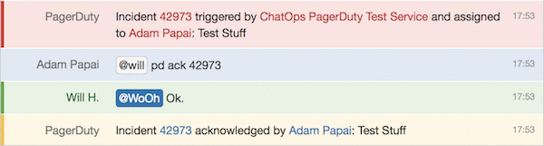

##### Resolve

You can resolve the acknowledged incidents. You can do 3 things:

- **@will pd resolve**: Resolve all acknowledged incidents assigned to you
- **@will pd resolve!**: Resolve all acknowledged incidents
- **@will pd resolve [incident number 1] [incident number 2]**: Resolve one or more specific incidents


##### Reassign

You can reassign one or more incidents to somebody else. 

**@will pd reassign [incident number 1] [incident number2] [mention name]**: reassign one or more specific incidents.


##### Schedule maintenance window

You can schedule a maintenance window for a specific service. The last - hour - parameter is optional. The default value is `1 hour`.

**@will pd maintenance [service name] [hour(s)]h**: Schedule a new maintenance window for x hours

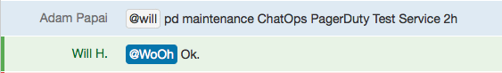

## Friendly

Will has personality, and we love that about him.  The friendly module includes some nice, silly, and appreciative aspects to will that really rounds out his personality.

#### Good morning / Good night

Will responds to "good morning", and "good night" appropriately, if he hears it.  If it's Friday, he'll even tell you to have a good weekend!

#### Hello

Saying hello is important.


#### Thanks

A little politeness goes a long way.


#### Cookies

We promised silly.

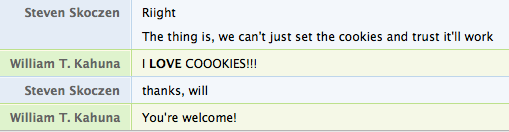

#### That's what she said.

Because seriously, bro. Read some awesome thought-provoking quotes, instead.

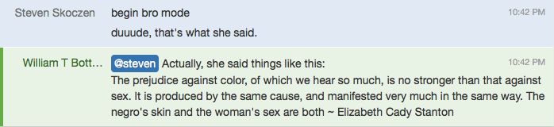

#### Love

One day, you'll find yourself saying this.  The response will make your week.


## Fun

There are a number of fun-facing plugins.  Check 'em out in the fun module or let them surprise you.

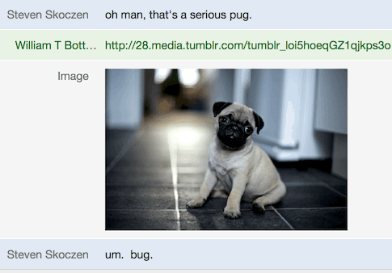

## Help

#### Help

Lists all the plugin commands with docstrings, bundled by module.


#### Programmer help

List all regexes for registered `@hear` and `@respond_to` decorators.  This is what help used to be, and may be pulled in the near future.


## Productivity

#### Bitly

If you want to shorten long URL using Bitly API, Will can do that for you in a few seconds:

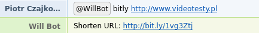

#### Hangout

If you've set a `HANGOUT_URL`, will will toss it in chat for you:

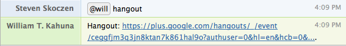

#### Image me

Sometimes, a picture is worth a thousand words.

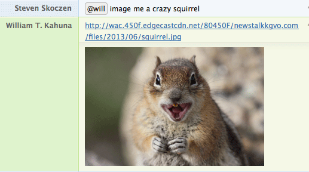

Image me works out of the box, but may not in future releases (we're using a pretty hacky way to get search results.)  If you rely on it, configure `image me` properly by setting the following two variables in `config.py` or [in your environment with the appropriate `WILL_` prefix](http://skoczen.github.io/will/config/). Here are some instructions on where to obtain both.

* `GOOGLE_API_KEY`
  * Go to the [Google Developers Console](https://console.developers.google.com).
  * From the menu in the top left, choose `API Manager -> Credentials`.
  * Click `Create credentials` from the drop down, then `API Key`, that's the key you need here.
  * Optionally, give the key a suitable human-readable name so it looks nice in the list e.g. `will-api`.
* `GOOGLE_CUSTOM_SEARCH_ENGINE_ID`
  * [Setup a custom search engine](https://support.google.com/customsearch/answer/2630963?hl=en) (CSE) if you don't already have one.
  * You'll need to provide a site for the CSE to search - just input anything, so the wizard can create the CSE.
  * Type something useful like `Will` in the name field and create the CSE.
  * Edit the settings for the CSE you just created, and in the `Sites to search` section, change the drop-down to `Search the entire web but emphasize included sites`.
  * Delete the "anything" site you added two steps ago, to clean it up.
  * In the `Details` section, click the `Search engine ID` button, and copy the ID which you need here.

#### Gif me

Like image me, but *alive*.


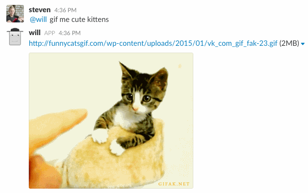

#### Remind me

This saves our bacon every day. Timeboxes meetings, helps people remember appointments, and enforces self-control.

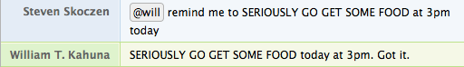

Then, when it's 3pm, and I still haven't stopped coding to eat:


Or, more practically,

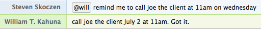


#### Remind somebody

You can also remind others as well.

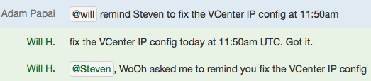


#### World time

We're a remote company. Maybe you are too. Or your clients are.  Or the light/dark cycle of the world just fascinates you.  If any of these are you, just ask Will to get the time in pretty much any city on earth.  Even our globe-trotting CEO hasn't been able to stump him.


## Version

Provides information about the release version of @will.

- **@will version**: Show the current running version.

## Web

This module's all about web-facing content.

#### Home page
Will also includes a home page, so you can fire him, up, browse to his URL, and see his smiling face.

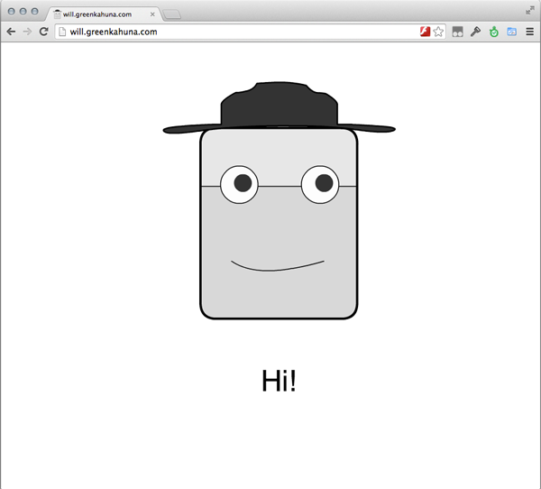


You now know everything about plugins.  Maybe you're wondering about the [finer points of config](../config.md)?  Or perhaps, you're ready to [deploy your will](../deploy.md)?
